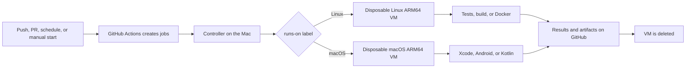

# Personal CI on an Apple Silicon Mac

This repository contains a **GitHub Actions runner controller** for an Apple Silicon Mac. It runs jobs from repositories you choose in disposable Linux ARM64 or macOS ARM64 virtual machines (VMs). GitHub triggers workflows, displays results, and stores artifacts; **the jobs run on your Mac**, not on a GitHub-hosted runner.

## Key terms

- A **workflow** is a YAML file in `.github/workflows/` that says *when* to run CI (on a push, pull request, schedule, or manual start).
- A **job** is one part of a workflow, such as “web tests” or “iOS build.” `runs-on` chooses the machine where it runs.
- A **runner** is the program that receives a job from GitHub and runs its steps. Here, a new runner is created in a disposable VM for each job.
- A **lane** is one of the four `runs-on` labels below. It selects Linux or macOS and keeps PR jobs separate from other events.

## How a job runs



The controller starts automatically after a user logs in to the Mac and checks GitHub at the interval in `config.json`. It only checks the repositories allowed in that local configuration. When a job is waiting, it clones a prepared Tart image, starts a VM with **4 vCPUs and 8 GiB of RAM**, registers a temporary runner in it, and normally deletes the VM when the job finishes. The current controller requires **two VM slots**; other jobs stay in the GitHub queue. The Mac must be powered on, connected to the network, and have a user logged in to accept new jobs.

| `runs-on` label | Event | Runs in |
| --- | --- | --- |
| `personal-ci-linux-arm64` | Push, schedule, manual | Ubuntu ARM64 VM with Docker |
| `personal-ci-linux-arm64-pr` | Pull request | Disposable Ubuntu ARM64 VM, PR queue |
| `personal-ci-macos-arm64` | Push, schedule, manual | macOS ARM64 VM with Xcode and Android tools |
| `personal-ci-macos-arm64-pr` | Pull request | Disposable macOS ARM64 VM, PR queue |

All four labels use **two base images**: one Linux and one macOS. The `-pr` suffix does not mean a different computer; it keeps PR jobs separate from other jobs. Fork PRs are allowed in isolated VMs, with no shared folders or clipboard access to the host. They still run untrusted code, so no host secrets should be placed in the images or passed to PR workflows. Set GitHub permissions in each project's workflow and review any job that needs write access. `pull_request_target` events are excluded.

## Where to find things

| File | Purpose |
| --- | --- |
| [`personal_ci/github.py`](personal_ci/github.py) | Finds queued jobs in allowed repositories and asks GitHub for a temporary runner. |
| [`personal_ci/fleet.py`](personal_ci/fleet.py) | Enforces the two-VM limit, reserves capacity, and tracks active jobs. |
| [`personal_ci/tart.py`](personal_ci/tart.py) | Clones, starts, and deletes each job's VM. |
| [`personal_ci/config.py`](personal_ci/config.py) | Checks the configuration, four lanes, and CPU/RAM budget. |
| [`config.example.json`](config.example.json) | Public template; the real `config.json` is ignored by Git. |
| [`scripts/bootstrap-linux.sh`](scripts/bootstrap-linux.sh), [`scripts/bootstrap-macos.sh`](scripts/bootstrap-macos.sh) | Prepare the two base images without GitHub credentials. |
| [`scripts/install-service.py`](scripts/install-service.py) | Installs the macOS service that restarts the controller after login. |
| [`.github/workflows/`](.github/workflows) | Verifies this repository and contains two manual VM tests. |

The [architecture guide](docs/architecture.md) explains the controller, VM lifecycle, and trust boundaries. The [workflow guide](docs/workflows.md) shows **which example workflows run in which VM** and how to route your own jobs. The [operations guide](docs/operations.md) explains how to set up, check, and troubleshoot the service. The [qualification checklist](docs/qualification.md) shows what to verify on your own host before relying on the runners.

## Check the installation

On the Mac, from the directory where you cloned this repository:

```sh
python3 -m personal_ci --config config.json doctor
python3 -m personal_ci --config config.json status
launchctl print gui/$(id -u)/dev.personal-ci.runners
```

`doctor` checks that the images and GitHub App key are present; `status` shows reserved VMs. The public repository contains no private key or token. The App's key is kept on the Mac, outside the repository, with `0600` permissions. The App requests tokens limited to repositories allowed by the local configuration, even if it is installed more broadly on the account.

This project is available under the MIT license. Tart comes from the [Tart project](https://tart.run/); GitHub's [documentation](https://docs.github.com/en/actions/reference/runners/self-hosted-runners) describes self-hosted runners.
