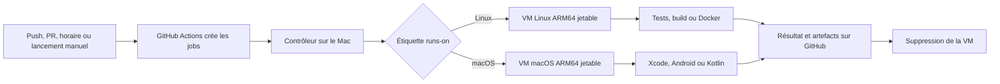

# CI personnelle sur un Mac Apple Silicon

Ce dépôt contient le **contrôleur de runners GitHub Actions** qui tourne sur un Mac M1 Pro. Il permet de lancer les tests et les builds de cinq dépôts personnels dans des machines virtuelles (VM) Linux ARM64 ou macOS ARM64. GitHub déclenche les workflows, affiche les résultats et conserve les artefacts ; **les calculs sont effectués sur le Mac**, pas sur un runner hébergé par GitHub.

## Les mots utiles

- Un **workflow** est un fichier YAML dans `.github/workflows/` qui indique *quand* lancer la CI (push, pull request, horaire ou lancement manuel).
- Un **job** est une partie du workflow, par exemple « tests web » ou « build iOS ». `runs-on` choisit la machine sur laquelle il s'exécute.
- Un **runner** est le programme qui reçoit un job de GitHub et exécute ses étapes. Ici, un nouveau runner est créé dans une VM jetable pour chaque job.
- Une **lane** est l'une des quatre étiquettes `runs-on` ci-dessous. Elle choisit Linux ou macOS et sépare les PR des autres événements.

## Le trajet d'un job



Le contrôleur, démarré automatiquement après l'ouverture de session sur le Mac, interroge GitHub toutes les 60 secondes. Il ne regarde que les cinq dépôts autorisés dans sa configuration locale. Quand un job attend, il clone une image Tart préparée, démarre la VM avec **4 vCPU et 8 Gio de RAM**, y enregistre un runner temporaire, puis supprime normalement la VM à la fin. Il ne lance jamais plus de **deux VM en parallèle** ; les autres jobs restent dans la file GitHub. Le Mac doit être allumé, connecté au réseau et avoir une session utilisateur ouverte pour prendre de nouveaux jobs.

| Étiquette `runs-on` | Événement | Exécuté dans |
| --- | --- | --- |
| `personal-ci-linux-arm64` | Push, horaire, manuel | VM Ubuntu ARM64 avec Docker |
| `personal-ci-linux-arm64-pr` | Pull request | VM Ubuntu ARM64 jetable, file PR |
| `personal-ci-macos-arm64` | Push, horaire, manuel | VM macOS ARM64 avec Xcode et outils Android |
| `personal-ci-macos-arm64-pr` | Pull request | VM macOS ARM64 jetable, file PR |

Les quatre étiquettes utilisent **deux images de base** : une Linux et une macOS. Le suffixe `-pr` n'indique pas un autre ordinateur ; il sépare les jobs PR des autres jobs. Les PR de forks sont admises dans des VM isolées, sans partage de dossier ou de presse-papiers avec l'hôte. Elles exécutent néanmoins du code non fiable : aucun secret de l'hôte n'est placé dans les images. Les permissions GitHub sont définies dans chaque workflow client ; certaines étapes, comme le commentaire de couverture de `finance`, demandent une écriture et doivent être examinées avant d'ouvrir davantage ces projets aux contributeurs externes. Les événements `pull_request_target` sont exclus.

## Où trouver chaque élément

| Fichier | Rôle |
| --- | --- |
| [`personal_ci/github.py`](personal_ci/github.py) | Repère les jobs en attente dans les dépôts autorisés et demande à GitHub un runner temporaire. |
| [`personal_ci/fleet.py`](personal_ci/fleet.py) | Applique la limite de deux VM, réserve leur capacité et suit les jobs en cours. |
| [`personal_ci/tart.py`](personal_ci/tart.py) | Clone, démarre puis supprime la VM de chaque job. |
| [`personal_ci/config.py`](personal_ci/config.py) | Vérifie la configuration, les quatre lanes et le budget CPU/RAM. |
| [`config.example.json`](config.example.json) | Modèle public ; la vraie configuration `config.json` est ignorée par Git. |
| [`scripts/bootstrap-linux.sh`](scripts/bootstrap-linux.sh), [`scripts/bootstrap-macos.sh`](scripts/bootstrap-macos.sh) | Préparent les deux images de base, sans identifiant GitHub. |
| [`scripts/install-service.py`](scripts/install-service.py) | Installe le service macOS qui relance le contrôleur après connexion. |
| [`.github/workflows/`](.github/workflows) | Vérifie ce dépôt et contient deux tests manuels des VM. |

La [carte des workflows](docs/workflows.md) détaille **quel workflow lance quels jobs et dans quelle VM** pour les cinq dépôts. Le [guide d'exploitation](docs/operations.md) indique comment vérifier le service et traiter une panne. Le [journal de qualification](docs/qualification.md) sépare les tests réellement réussis des capacités non encore vérifiées.

## Vérifier l'installation

Sur le Mac, depuis le dossier `~/ci-runners` :

```sh
python3 -m personal_ci --config config.json doctor
python3 -m personal_ci --config config.json status
launchctl print gui/$(id -u)/dev.personal-ci.runners
```

`doctor` vérifie la présence des images et de la clé GitHub App ; `status` affiche les VM réservées. Le dépôt public ne contient ni clé privée ni jeton. La clé de l'App est conservée sur le Mac, hors du dépôt, avec des permissions `0600`. L'App demande des jetons limités aux dépôts autorisés par la configuration locale, même si elle est installée plus largement sur le compte.

Ce projet est indépendant et sous licence MIT. Tart vient du [projet Tart](https://tart.run/) ; l'API des runners temporaires est décrite dans la [documentation GitHub](https://docs.github.com/en/actions/reference/runners/self-hosted-runners).
