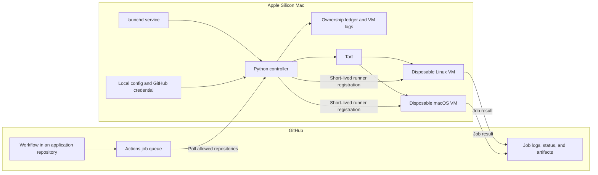

# Architecture

This page explains how the controller turns a GitHub Actions job into a disposable VM on **one Apple Silicon Mac**. Start with the [README](../README.md) for basic terms, then use the [workflow guide](workflows.md) to choose a runner label and the [operations guide](operations.md) to set up the host.

## Components and boundaries

GitHub owns the workflow trigger, queue, job steps, logs, and artifacts. This repository does not contain your application's workflows or test commands. The Mac hosts the controller, a stopped Linux base image, a stopped macOS base image, and short-lived clones used for jobs. The controller runs as a per-user LaunchAgent after login; it does not accept jobs while the host is off, asleep, disconnected, or logged out.

The local `config.json` selects one GitHub account, an explicit repository allowlist, four runner labels, image names, paths, and a polling interval. It is ignored by Git. A GitHub App key stays in a separate host file; the App installation token is restricted to the configured repositories. The controller only discovers jobs in that allowlist. Current GitHub App discovery uses a **user-account installation**; organization installations would require code changes.

## Admission and execution

1. An application workflow creates a queued job with one of the labels in the [workflow guide](workflows.md). Push, schedule, and manual jobs use regular labels; `pull_request` jobs use `-pr` labels. The controller ignores `pull_request_target` and jobs with other labels.
2. On each poll, the controller checks the allowed repositories for queued jobs. It admits a job only if a slot is free and the configured minimum disk space remains available. The current code requires **two slots**, each with **4 vCPUs and 8 GiB of RAM**. Jobs that cannot be admitted remain in GitHub's queue.
3. Before starting a VM, the controller writes its generated name and job ID to a host-side ownership ledger. Tart clones the appropriate stopped base image, applies the VM size, and starts the clone with Softnet networking and no host clipboard or folder share.
4. When the guest is ready, the controller requests a one-job runner configuration from GitHub and delivers it to the guest over standard input. The runner executes the workflow steps inside the clone. Linux images can provide Docker; macOS images can provide Xcode and other tools installed during image preparation.
5. After the runner exits, the controller retains its VM log on the host, deletes its owned clone, and releases the slot. GitHub retains the job result and any artifacts uploaded by the workflow.

The four labels share two base images: the PR suffix selects an admission lane, not a separate host or persistent VM. Base images must remain stopped and must not contain runner registration data, application secrets, or a checkout from a previous job.

## Failure and trust boundaries

The ownership ledger prevents a controller restart from mistaking a still-present clone for free capacity. On restart, the controller marks such clones for inspection. If a job or cleanup fails and a clone still exists, its slot stays reserved until an operator checks its GitHub job, VM, and logs. The controller does not delete unknown VMs. See [operations](operations.md) for the recovery commands.

A fork PR can run untrusted code in a disposable VM. The VM boundary limits access to the host, but workflow permissions still matter: do not pass the GitHub App key, host credentials, signing material, or write-capable tokens to PR jobs. Each application's workflow defines its own `permissions` and artifact behavior.

This implementation manages one Mac with one local capacity ledger. It does not coordinate multiple hosts, provide a host-executed job lane, sign or deploy applications, or guarantee that a particular ARM64 toolchain works. Validate Linux, macOS, PR, simulator, and application workloads on your own host with the [qualification checklist](qualification.md).
